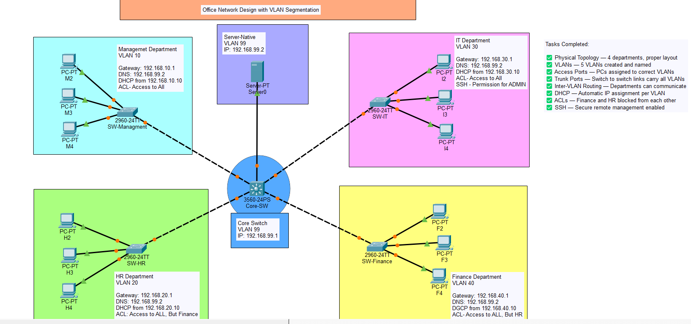
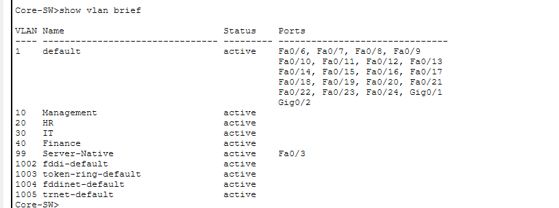
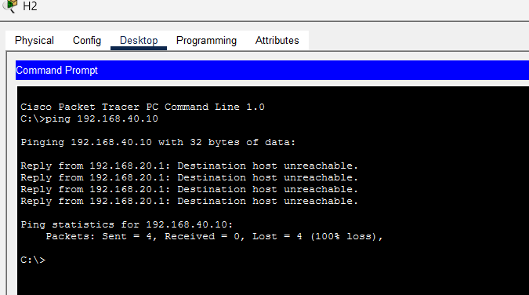
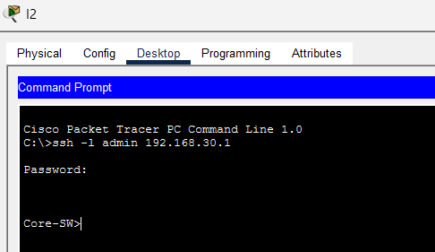

# Office Network Design with VLAN Segmentation
### Network Administration — Project

## Project Overview
This project presents the design and implementation of a secure, 
segmented office network using VLAN technology, simulated in 
Cisco Packet Tracer. The network is designed for a medium-sized 
office with four departments — Management, HR, IT, and Finance.

## Network Topology

## Technologies Used
- Cisco Packet Tracer 9.0
- Cisco 3560-24PS Multilayer Switch
- Cisco 2960-24TT Access Switches
- VLANs (IEEE 802.1Q)
- Inter-VLAN Routing (SVI)
- DHCP Server
- Access Control Lists (ACLs)
- SSH Version 2

## VLAN Design
| VLAN ID | Department | Subnet |
|---------|------------|--------|
| VLAN 10 | Management | 192.168.10.0/24 |
| VLAN 20 | HR | 192.168.20.0/24 |
| VLAN 30 | IT | 192.168.30.0/24 |
| VLAN 40 | Finance | 192.168.40.0/24 |
| VLAN 99 | Server | 192.168.99.0/24 |

## Features Implemented
- VLAN segmentation for department isolation
- Inter-VLAN routing using Layer 3 Switch SVIs
- Centralised DHCP server with per-VLAN pools
- ACLs blocking Finance↔HR communication
- SSH Version 2 for secure remote management

## Test Results
| Test | Result |
|------|--------|
| Same VLAN Communication | ✅ Pass |
| Inter-VLAN Communication | ✅ Pass |
| Finance → HR (ACL Block) | ✅ Blocked |
| HR → Finance (ACL Block) | ✅ Blocked |
| All Depts → Server | ✅ Pass |
| DHCP Auto Assignment | ✅ Pass |
| SSH Remote Management | ✅ Pass |

## Screenshots
### Network Topology

### VLAN Configuration

### ACL Blocking Test

### SSH Remote Access

## How to Open
1. Install Cisco Packet Tracer 9.0
2. Open MinorProject.pkt
3. All configurations are pre-loaded

## Author
**Taranjeet Singh**  
Network Administration — Project  
April 2026
